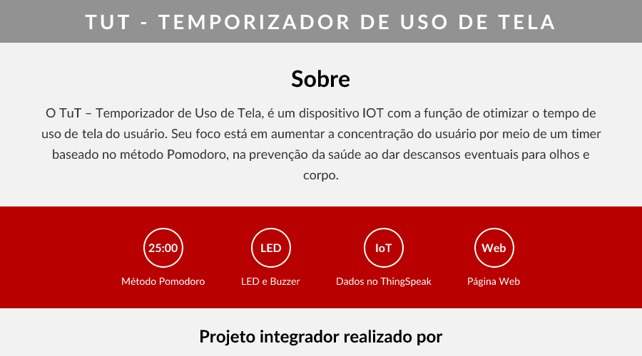

# TUT - Temporizador de Uso de Tela



O **TUT** (Temporizador de Uso de Tela) é um projeto de Internet das Coisas (IoT) projetado para otimizar o tempo de uso de tela do usuário. O dispositivo visa melhorar a concentração e a saúde do usuário, incorporando um temporizador baseado no **método Pomodoro**, intervalos regulares para descanso dos olhos e do corpo, e a capacidade de monitorar o tempo de uso de tela.

## Funcionalidades

- ⏱️ Timer baseado no método Pomodoro (25 min trabalho / 5 min intervalo curto / 15 min intervalo longo)
- 💡 Sinalização via LED e buzzer para início e fim de ciclos
- 📊 Envio automático de dados de uso para o ThingSpeak
- 🌐 Página web para acompanhamento do tempo de uso diário

## Estrutura do Projeto

```
TUT/
├── TUT.py                        # Código principal do dispositivo (Raspberry Pi)
├── MVP.pdf                       # Documento do Minimum Viable Product
├── package.json                  # Dependências Node.js (Satori)
├── scripts/
│   └── generate-preview.js       # Script para gerar imagem de preview com Satori
├── Site/                         # Página web do projeto
│   ├── index.html
│   ├── script.js
│   ├── styles.css
│   ├── tut2.png
│   └── preview.png               # Imagem de preview gerada com Satori
└── README.md
```

## Tecnologias Utilizadas

- **Raspberry Pi**: Utilizado para construir o hardware do projeto com GPIO, permitindo a interação do dispositivo com o usuário por meio de LED, buzzer e botão.
- **Python**: Empregado para desenvolver o código do dispositivo e consumir a API do ThingSpeak.
- **HTML, CSS e JavaScript**: Utilizados na criação de uma página web amigável que acompanha o dispositivo.
- **Satori**: Utilizado para gerar a imagem de preview da aplicação a partir de código.
- **ThingSpeak**: Plataforma utilizada para análise e visualização dos dados coletados pelo dispositivo.
- **Metodologias Ágeis**: Abordagem de desenvolvimento ágil, fazendo uso de MVP (Minimum Viable Product), SCRUM e a ferramenta Trello para o gerenciamento eficaz do projeto.

## Pré-requisitos

- Raspberry Pi com GPIO
- Python 3
- Bibliotecas Python: `RPi.GPIO`, `requests`
- Componentes de hardware: LED, buzzer e botão

## Como Usar

1. Conecte o LED ao pino GPIO 19, o buzzer ao pino GPIO 23 e o botão ao pino GPIO 18.
2. Instale as dependências:
   ```bash
   pip install RPi.GPIO requests
   ```
3. Execute o script:
   ```bash
   python TUT.py
   ```
4. Pressione o botão para iniciar/parar o timer.

## Equipe

Projeto integrador realizado por alunos do segundo termo de Big Data no Agronegócio da FATEC Shunji Nishimura em 2023:

- Danielli Borges
- Gabriel Vale
- Jeferson Melo
- Willian Neves

## Acesso ao Projeto

O código-fonte e os arquivos relacionados estão disponíveis aqui mesmo neste repositório.
